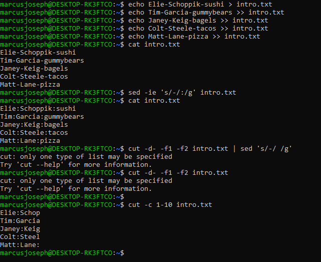
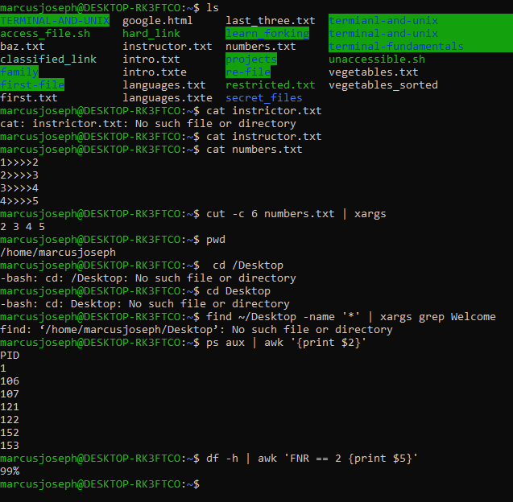

# { Advanced Terminal Exercises. }

## part I
- Elie-Schoppik-sushi
- Tim-Garcia-gummybears
- Janey-Keig-bagels
- Colt-Steele-tacos
- Matt-Lane-pizza

1. Replace all of the - with : using `sed`
2. Return a file with just the first name and last name separated by a space (you can do this with `cut` and `sed` or just `sed`)

- 1>>>>2
- 2>>>>3
- 3>>>>4
- 4>>>>5

1. Using `cut` print out just the numbers 2, 3, 4, 5. Use `xargs` to print them all on 1 line
2. Using `xargs` in the `./Desktop` directory, find all of the files that include the text `Welcome`
3. Write a shell script called `access_file.sh` which accepts one parameter and changes the permissions to `755`
4. Write a shell script called `unaccessible_sh.sh` which accepts one parameter and changes the permissions to `300`
5. Using `sed` write the command to replace all instances of the name "foo" with the string "bar" in a file called `baz.txt`
Write the command to only print out all of the `pids` using `awk`
Type in the `df -h`  command - it will show you much space you have on your hard drive. Using the `awk` command, print out only the first percentage capacity.

