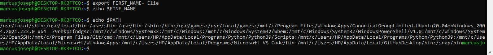

# { Intermediate Terminal Exercises. }

## Part I
1. Create an environment variable called `FIRST_NAME` and set it equal to your first name (this does not need to be permanent)
2. Print the `FIRST_NAME` variable
3. Print out the `$PATH` variable
4. What is the ``$PATH` variable?

5. Why would you want to create an environment variable? **Environment variables are predetermined values that are typically used to provide the ability to configure a value in your code from outside of your application.**
6. How do you permanently save environment variables? ** you save them n=by configuring your **.bash_profile or .zshrc**
7. What is a process? **A process is a program on your computer that is being run for example runing an `ls` command is a process when it been outputed on your cumputer**
8.How do you list all processes running on your machine? `ps -aux`
9. What is a PID? **is a number that uniquely identifies the process and is is also use to stop a process**
10. How do you terminate a process? **we use `kill` and the PID you want to terminate.**
11. What is the difference between kill and kill -9? ** Kill will generate a SIGTERM signal asking a process to kill itself gracefully i.e , free memory or take care of other child processes. ... Kill -9 generates a SIGKILL signal which won't check the state of the process and kills the process immediately.**
12. What grep flag allows for case insensitive search? `-i`
13. What grep flag allows for case insensitive search? `-B`
14. What grep flag allows for a certain number of lines around the match? `-C`
15. What grep flag allows for a certain number of lines after the match? `-A`
16. What grep flag allows for full word search? `-w`
17. What grep flag shows you the line number of a match? `-n`

## part II
1. Find all files inside the `Desktop` folder that have a name of "learn." **`find ~/Desktop -name "learn"`**
2. Find all files inside the `Desktop` folder that start with a "P." **`find ~/Desktop -name "P`**
3. Find all files inside the `Desktop` folder that end with `.txt.` **`find ~/Desktop -name "*.txt"`**
4. Find all files inside the `Desktop/views` folder that have the name `data`  somewhere in their filename.**`find ~/Desktop/views -name "*data*"`**
5. Inside of the `instructors.txt` file, output the number of times the word "Elie" appears. **`grep -c "Elie" instructors.txt`**
6. Inside of the `instructors.txt` file, list all matches for any full word that starts with a capital "P."**`grep -w "P.*" instructors.txt`**
7. Inside of the `instructors.txt` file, list all the line numbers for any full word that starts with a "z" (it should match regardless of upper or lower case). **`grep -ni "z.*" instructors.txt`**
