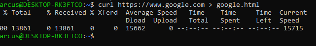
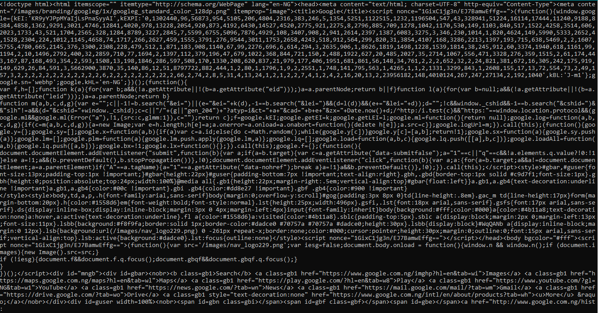
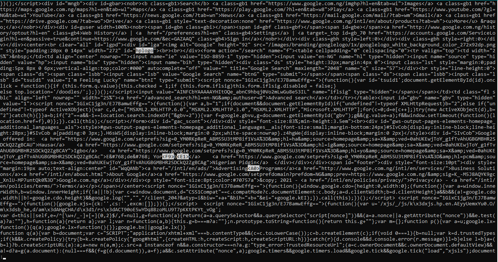

# { Terminal Basics Exercises. }
Write the following terminal commands to perform the following tasks:

### Part I
1. make a directory called `first`
2. change directory to the `first folder`
3. create a file called `person.txt`
4. change the name of `person.txt` to `another.txt
5. make a copy of the `another.txt` file and call it `copy.txt`
6. remove the `copy.txt` file
7. make a copy of the `first` folder and call it `second`
8. delete the `second` folder

## part II
1. What does the man command do? Type in man rm. How do you scroll and get out? **The man command lists the manual for a command - D or Control ⌃-D to advance half a page - B or Control ⌃-B to go back one page - U or Control ⌃-U to go back half a page**
2. Look at the man page for ls. What does the -l flag do? What does the -a flag -do? **The -l flag lists files in a list format with more detail and the -a lists all files and folders including hidden ones**
3. Type the following command to download and save the contents of google.com: `curl https://www.google.com > google.html curl https://www.google.com > google.html`

4. Use less to look at the contents of google.html. `less google.html`

5. Look at the man page for less. Read the section on /pattern. Search for the text hplogo in the google.html file. `less -p hplogo google.html`

6. How do you jump between words in the terminal? **option left/right**
7. How do you get to the end of a line in terminal? **control + e**
8. How do you move your cursor to the beginning in terminal? **control + a** How do you delete a word (without pressing backspace multiple times) in -terminal? **option + delete**
9. What is the difference between a terminal and shell? **The terminal is a program is just an interface to the shell. The shell is what actually handles commands and so forth; the terminal program just gives it a way to interact with the environment.**
10. What is an absolute path? **An absolute path is a path that starts from the root route and gives the complete location for a file or folder**
11. What is an relative path? **A relative path is a path that starts at the current location and not the root route**
12. What is a flag? Give three examples of flags you have used. **A flag adds additional functionality to an existing command, we have seen -a and -l for the ls command and -r for the cp and rm commands**
13. What do the r and f flags do with the rm command? **r will remove folders and recursively go through each folder and file and f will force removal**